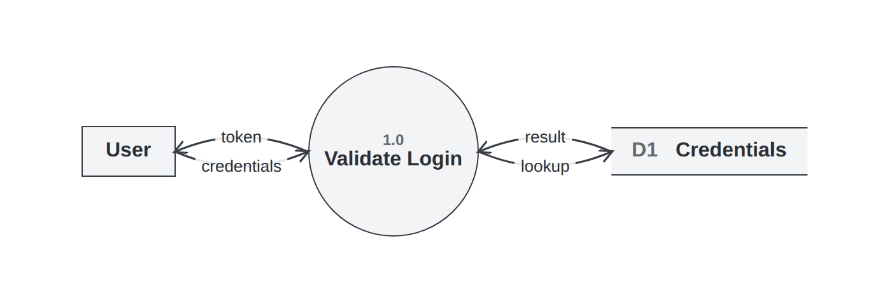
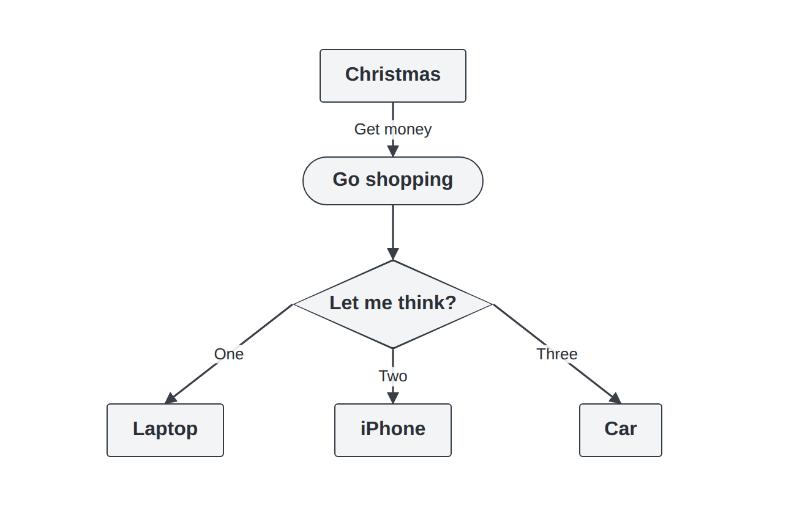
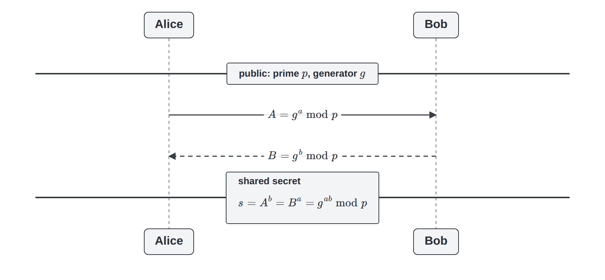
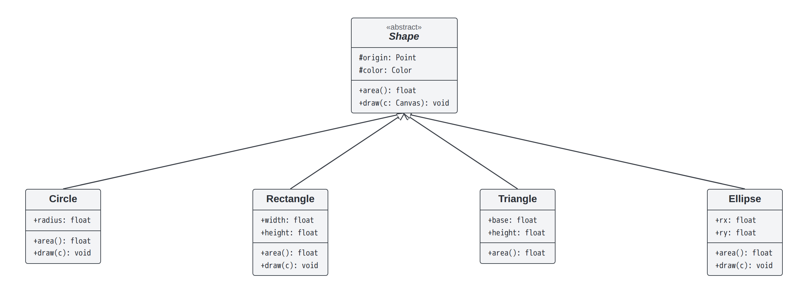

# diagrams

> UML diagrams you lay out yourself with CSS — manual, but adaptive: no auto-routing, no hardcoded coordinates. Claude writes the markup.

`diagrams` sits between two frustrations. Mermaid and PlantUML **auto-layout and auto-route** — and when they drop a box on the wrong side, there is no clean way to overrule them. Drawing tools give you control but make you nail down **pixel coordinates** that break the moment a label changes. This is neither: you declare _structure_ with plain **HTML and CSS** (grid, flex, relative positioning) and connect boxes with `<arrow>`. Boxes size to their content and connectors are measured _after_ layout, so arrows follow the boxes wherever CSS puts them — change the structure, re-render, everything re-attaches. The output is a crisp **PNG**, or a self-contained **HTML** page you can embed live.

The usual cost of writing layout by hand is verbosity. The answer: **you don't write it — Claude does.** This ships as a Claude Code plugin; you describe the diagram, Claude emits the HTML, you nudge a value, re-render.

## Quickstart

Install the plugin in Claude Code:

```
/plugin marketplace add butvinm/diagrams
/plugin install diagrams@diagrams
```

Then describe the diagram — _"draw a login sequence: Alice → auth service → DB, returning a token"_ — and Claude authors the HTML, renders it to PNG, inspects the result, and iterates until it matches. The first render auto-installs a headless browser (or reuses system Chrome/Edge).

## Examples

**Sequence** · [source](tests/cases/sequence-basic/ours.html)


**State / FSM** · [source](tests/cases/state-basic/ours.html)


**Class** · [source](tests/cases/class-basic/ours.html)


**Deployment** · [source](tests/cases/deployment-basic/ours.html)


**Data Flow** · [source](tests/cases/dfd-basic/ours.html)



**Flowchart** · [source](tests/cases/flowchart-basic/ours.html)



**Math (LaTeX via KaTeX)** · [source](tests/cases/sequence-math/ours.html)



**Responsive / embeddable** · [source](tests/cases/class-responsive/ours.html)



See the **[live gallery](https://butvinm.github.io/diagrams/)** — its hero is a resizable embed you can drag to watch a diagram reflow.

## Documentation

- [Authoring guide](docs/GUIDE.md) — how it works, and writing a diagram by example.
- [Component reference](diagrams/skills/diagrams/references/COMPONENTS.md) — every component, attribute, and style.
- [Embedding](diagrams/skills/diagrams/references/EMBED.md) — embedding diagrams in pages: `fluid` responsive diagrams and self-contained HTML output.
- [Development](docs/DEVELOPMENT.md) — the test harness, goldens, the comparison gallery, and the published GitHub Pages gallery.

## Credits

[KaTeX](https://katex.org/) (MIT) is vendored to typeset LaTeX math in labels. Mermaid (MIT) is used only to render reference images for side-by-side comparison. Both are noted in [`THIRD_PARTY.md`](THIRD_PARTY.md).

## License

MIT — see [LICENSE](LICENSE).
