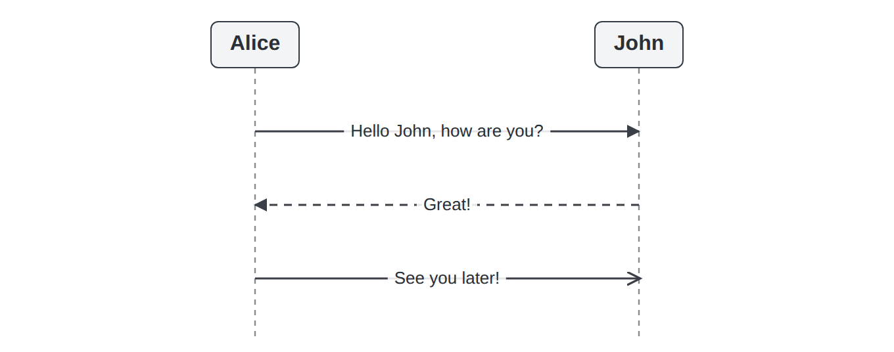
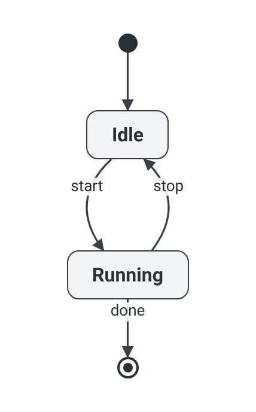
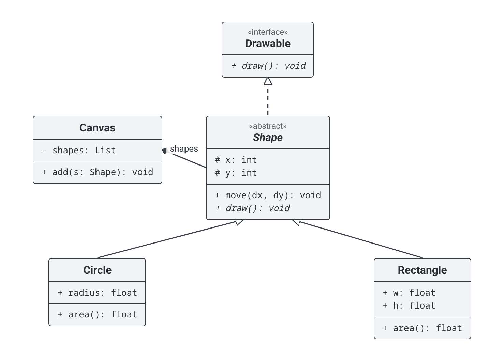

# diagrams

> UML diagrams you lay out yourself with CSS — manual, but adaptive: no auto-routing, no hardcoded coordinates. Claude writes the markup.

`diagrams` sits between two frustrations. Mermaid and PlantUML **auto-layout and auto-route** — and when they drop a box on the wrong side, there is no clean way to overrule them. Drawing tools give you control but make you nail down **pixel coordinates** that break the moment a label changes. This is neither: you declare _structure_ with plain **HTML and CSS** (grid, flex, relative positioning), connect boxes with `<arrow>`, and render to a crisp **PNG**.

So the layout is **manual but adaptive**. You decide the arrangement, not a guessing engine — but you write _no coordinates_. Boxes size to their content, the grid reflows predictably, and because connectors are measured _after_ layout, arrows follow the boxes wherever CSS puts them. Change the structure, re-render, everything re-attaches.

The usual cost of writing layout by hand is verbosity. The answer: **you don't write it — Claude does.** This ships as a Claude Code plugin; you describe the diagram, Claude emits the HTML, you nudge a value, re-render.

<p align="center">
  
  &nbsp;&nbsp;&nbsp;
  
  &nbsp;&nbsp;&nbsp;
  
</p>

<p align="center"><sub>All rendered by the tool — laid out in CSS, no coordinates.</sub></p>

## Why

- **You decide, not a solver** — the arrangement comes from CSS you (or Claude) write, never from a layout engine's guesses.
- **Adaptive, not hardcoded** — you declare structure (grid/flex/relative), not pixels; boxes size to their content and connectors re-attach on re-render.
- **No routing** — a connector is a pure function of its two anchor points and a path style; it never bends around things on its own.
- **Real HTML/CSS** — rich labels are just markup (icons, badges, multi-line), styling is CSS. Nothing reinvented.
- **Clean output** — headless Chromium screenshots at 2–3×: sharp in READMEs, slides, and docs.

## Quickstart

Install the plugin in Claude Code:

```
/plugin marketplace add butvinm/diagrams
/plugin install diagrams@diagrams
```

Then describe the diagram — _"draw a login sequence: Alice → auth service → DB, returning a token"_ — and Claude authors the HTML, renders it to PNG, inspects the result, and iterates until it matches. The first render auto-installs a headless browser (or reuses system Chrome/Edge).

## Documentation

- [Authoring guide](docs/GUIDE.md) — how it works, and writing a diagram by example.
- [Component reference](diagrams/skills/diagrams/references/COMPONENTS.md) — every component, attribute, and style.
- [Development](docs/DEVELOPMENT.md) — the test harness, goldens, and the comparison gallery.

## Diagram types

| Type        | Status  |
| ----------- | ------- |
| Sequence    | ✅      |
| State / FSM | ✅      |
| Class       | ✅      |
| Deployment  | planned |

Everything is boxes + arrows under the hood; a "type" is just a layout convention and a few CSS styles on top of one engine.

## Credits

Mermaid (MIT) is used only to render reference images for side-by-side comparison; sources are noted in [`THIRD_PARTY.md`](THIRD_PARTY.md).

## License

MIT — see [LICENSE](LICENSE).
